# A Pragmatic Approach

- The Essence of Good Design
- DRY - The Evils of Duplication - avoid duplication of information.
- Orthogonality - avoid splitting one piece of knowledge across multiple system components.
- Reversibility - how to make our applications relevant to changing environment?
- Tracer Bullets - style of development that is only way to keep up with pace of modern life.
- Prototypes and Post-it Notes - How to test architectures, algorithms, interfaces, ideas before committing to them?
- Domain Languages - some suggestions which can be implemented.
- Estimating - How to get good at working out how long things will take?

## The Essence of Good Design

- The world is full of gurus and pandits, all eager to pass on their hard-earned wisdom when it comes to "How to Design Software".
- There are a lot of information out their in internet. But, what is good design?

> Good Design is Easier to Change Than Bad Design

 - A thing is well designed if it adapts to the people who use it.
 - For code, that means it must adapt to changing.
 - ETC principle: Easier to Change. Every design principle is an special case of ETC.
    - Decoupling - Because of isolating concerns we make change easy. ETC!
    - Single Responsibility principle - When we need to change, we have to do only in 1 module. ETC!
    - Naming - Easy to understand code. Why? To change. ETC!

### ETC is a Value, Not a Rule

 - Values help you make tough decisions easy. Should I do this or that?
 - In software, ETC is a guide, helping to choose between paths which should be a concious thought, subtly nudging you in the right direction.
 - How do you make this happen?
    - Requires some initial conscious reinforcement.
    - For every file you save, fix a bug, write a test (if you do :) ask,
        - Did the thing I just did make the overall system easier or harder to change?
 - ETC assumes that a person can decide which of the multiple paths would be easier to change in the future based on common sense.
 - If you are not able to choose a path, that's OK. In those cases,
    - First, you would not be aware what kind of change would happen.
    - Fallback to "easy to change" path, trying to write replacable code by having it decoupled and cohesive.
    - Seems extreme, but we are supposed to do this all the time.
    - The code that you write should not become an roadblock for change to happen in future.
    - Second, reach out to your instincts.
    - Take a guess what kind of change would be needed in future and tag it in the code (as a comment)
    - So when the change happens, you can give feedback to yourself and it will help you in future fork in the road.
 - All other topics in this chapter are motivated by this one principle, ETC.

 ### Challenges

  - Think about a design principle you use regularly. Is it intended to make things easy-to-change?
  - Also think about languages and programming paradigms (OO, FP, Reactive, and so on). Do any have either big positives or big negatives when it comes to helping you write ETC code? Do any have both?
    - When coding, what can you do to eliminate the negatives and accentuate the positives?
  - Many editors have support (either built-in or via extensions) to run commands when you save a file. Get your editor to popup an ETC? message every time you save (or 10th time) and use it as a cue to think about the code you just wrote. Is it easy to change?

  ## DRY - The Evils of Duplication

   - Best way to disabling a marauding artificial intelligence - give 2 pieces of contradicting knowledge to a computer.
   - Same principle is effective in bringing down your code.
   - Programmers collect, organize, maintian and harness knowledge.
   - Knowledge is documented in specifications, comes alive in code and used to validate things in testing.
   - Knowledge isn't stable. It changes very frequently after a meeting with client, when regulations change and when we know the approach we have chosen does not work.
   - When it changes, you re-organize and re-express it in some form which is true at that time.
   - Maintenance is not a discrete activity that happens post production with just bug fixes and enhancements but a routine part of development process.
   - Maintenance happens each day long before the application is fully developed and released to the end customer.
   - You maintain knowledge from day 1 of project either knowingly or unknowingly.
   - When we maintain we need to find and change what you have earlier done - code, documentation, API, etc...
   - We invite a maintenance nightmare by doing the easiest thing to do - duplicate knowledge in multiple places.

   ### Solution ?

   - The only way to develop software reliably and to make our developments easier to maintain is to follow the DRY principle.

   > Every piece of knowledge must have a single, unambiguous, authoritative representation within a system.

   > DRY - Don't Repeat Yourself

   - What happens when you do not follow DRY ?
      - You represent the same thing in 2 or more places in different ways (sometimes it even takes time to understand it is the same thing).
      - When you have to change in 1 place you have to remember to change in other places.
      - It is not a question if you will remember, it is a question of when you'll forget.
      - Your software will come to its knees with the wave of changes that happens in outside world with this duplication.

   ### DRY is More Than Code

   - DRY is not just about not copying source code or having same code in multiple places (authors correct from 1st edition).
   - Code duplication is part of DRY but a very tiny part.
   - It is more about not duplicating knowledge or intent.

   ### Duplication in Code

   - Though trivial, it is so common.
   - Let us look at below code.
   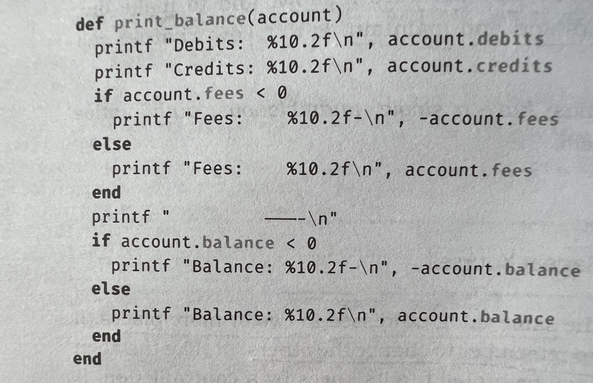
   - What are the instances where DRY is violated?

   1. Copy paste duplication for handling negative numbers - fixing that,
   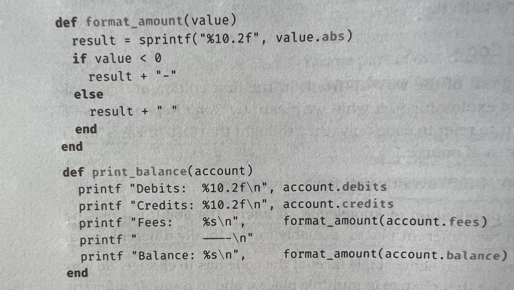
   2. Repetition of field width specification in each printf call. Fixing that using existing function,
   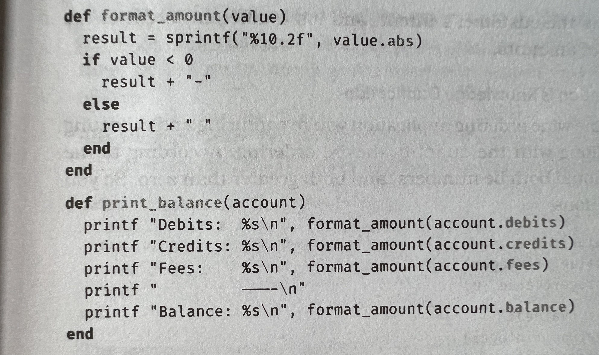
   3. What if we need an extra space between the field labels and numbers? We need to change in each printf. Fixing that,
   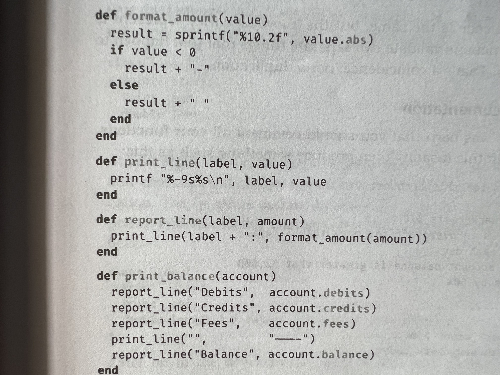

   - Result?
      - Want to change number format - change format_amount function.
      - Want to change label format or spacing - change report_line function.

   ### Not all Code Duplication is Knowledge Duplication

   - Below is an example of an false positive.
   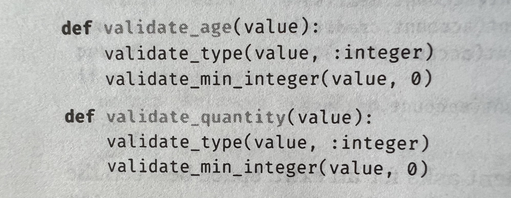

   - Though the code is same in above definitions, we are validating 2 differetent real world entities that might have different set of things to be done in future.
   - It is just coincidence we are doing same thing with age and quantity at present. It may not stay the same in future.

   ### Duplication in Documentation

   - **Myth**: You should comment all your functions.
   - No. Not required. Identify DRY violation in below snippet.
   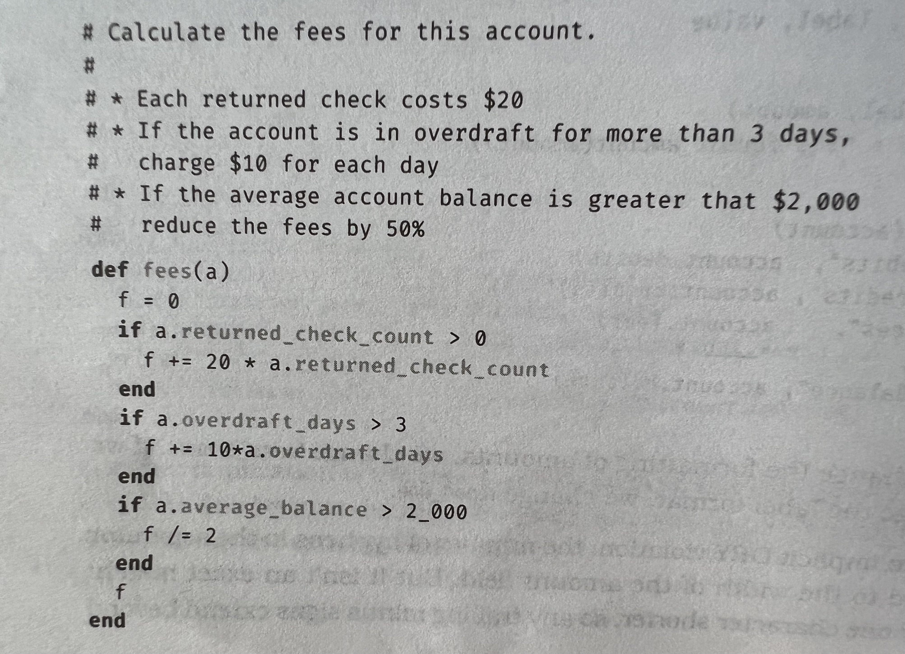

   - Fix:
   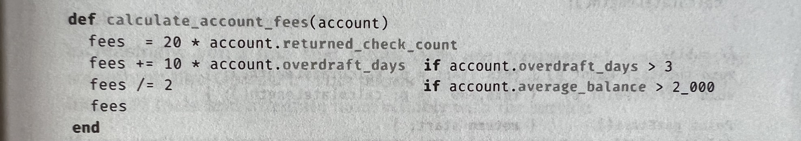

   - When code is readable, comments are redundant.
   - Above avoids changing in 2 places, once in code and again in comments and mostly we miss changing comments.

   ### DRY violations in Data

   - Data Structures represent knowledge and that could also violate DRY principle.

   - Snippet of Class with some properties:
   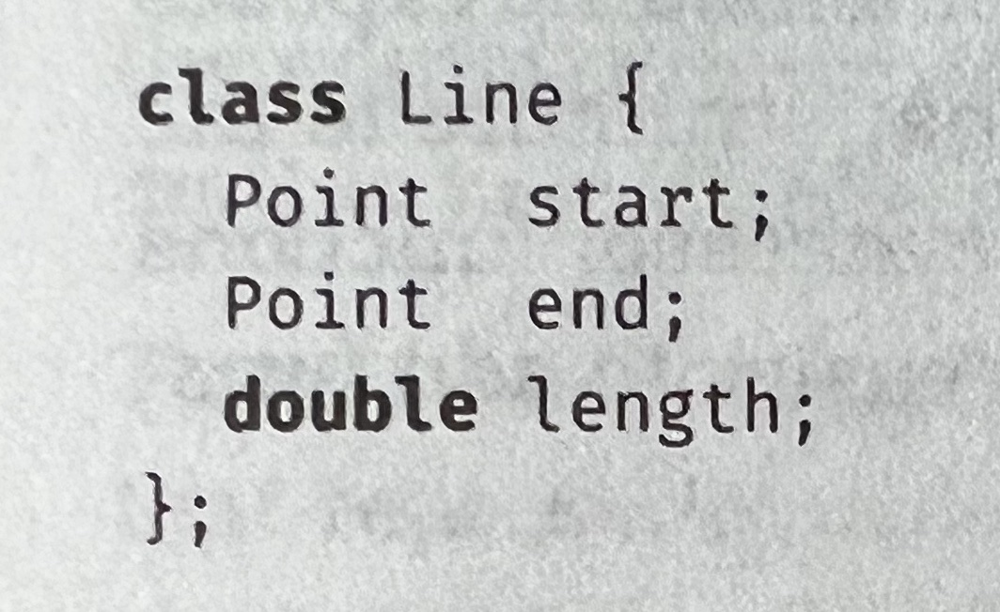

   - At 1st sight, above class look fine.
   - But, can we not derive length from other two properties?
   

   - There might be concerns that this might not allow the data to cache and result in poor performance.
   - To mitigate that, keep the impact local by using private modifiers so that the code outside the class does not know that this is calculated each time.
   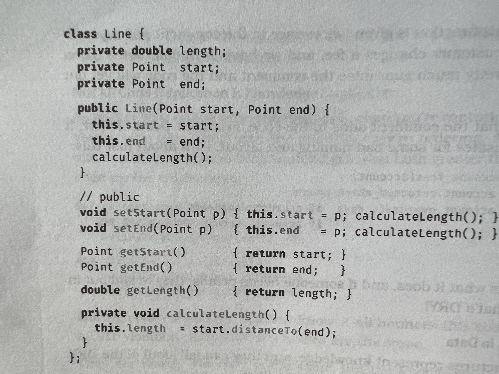

   - In above example, we are still coupling the code that uses a structure to implementation of the module.
   - Try to use accessor functions wherever possible. This will make future changes easier. ETC!

   - Meyer's Uniform Access Principle
   > All services offered by a module should be available through a uniform notation, which does not betray whether they are implemented through storage or through computation.

   ### Representational Duplication

   - Our code interacts with outside world libraries via APIs, services via remote calls, gets data from external sources and so on.
   - For all the above your code (and the external thing you communicate with) needs to be in sync with the knowledge of how to communicate (schema) and what the error codes mean?
   - This gives a chance for DRY violation as the same knowledge is duplicated in your code and also in the external thing.
   - Changing any one breaks the other.
   - Though this duplication is inevitable, it can be mitigated by following strategies.

   #### Duplication Across Internal APIs

   - Identify tools that will generate documentation automatically from your code (which would be neutral)
   - These tools can be used to create functional tests, API clients in different languages to test your API
   - Creates a shared repository which can be used by external world and once you change anything in your API the tool will get updated automatically

   #### Duplication Across External APIs

   - Use OpenAPI specification to get information about public APIs
   - This provides a language agnostice way (or) a common syntax for APIs in different languages to understand the API and communicate with it
   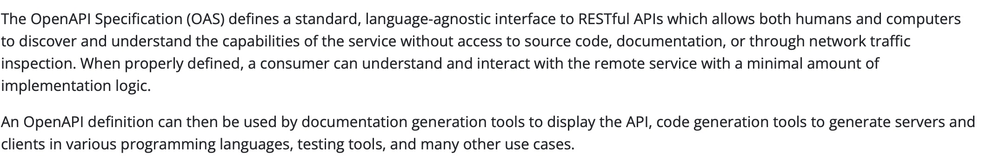
   - If you don't find an OpenAPI specification, create and publish it.

   #### Duplication with Data Sources

   - Create containers to store data from external data source using their schema.
   - Another option is to
      - Instead of representing external data in fixed structure like struct, class using key/value data structure will make flexible.
      - In addition to above do validations that will make sure you are getting the data you expect as key/value data structure stores any data type.

   ### Interdeveloper Duplication

   - Hardest type of duplication to detect
   - Entire sets of functionalities would be duplicated between developers and would go undetected for years
   - In a audit in US, it was found that there were 10,000 programs that contained a different version of Social Security Number validation code.

   

   - How to solve this?
      - At a high level, build a strong, tight-knit team with **good communications**
      - At a module level, it is challenging as common functionalities or data does not fall into as a single person responsibility (that is why it is common)
      - Best way to deal with this is again encouraging active and frequent communication between developers in the team.
      - Can be best achieved by knowledge sharing and we can identify common areas and work together to avoid duplicated knowledge.
      - An good example is discourse we have at Axelerant where common problems and solutions are available.
      - Look into other people code when needed if there is commonality and also be open when others' would want to look at your code. We are sharing and improving our knowledge.

   > Make it Easy to Reuse

      - If it isn't easy, people would not do it.
      - If you fail to reuse, you risk duplicating knowledge.

   ## Orthogonality

   - Critical concept to produce systems that are easy to design, build, test and extend.
   - Causes immediate improvements in quality of systems if applied directly.

   ### What is Orthogonality?

   

   - 2 lines are orthogonal if they meet at right angles (90 degrees)
   - In computing, it denotes independence or decoupling
   - Two or more things are orthogonal, if changes in one does not affect any of the others.
   - E.g. Database logic and User interface
   - Real word example: Helicopter controls are decidedly not orthogonal.

   ### Benefits of Orthogonality

   > Eliminate Effects Between Unrelated Things

   - Nonorthogonal systems are inherently more complex to change and control as changing one thing breaks lot of others.
   - Components to be:
      - self-contained: does not depend on other components to achieve its purpose and hence can function independently by its own.
      - single well defined purpose: single responsibility principle
   - Any change in component does not affect the external system and we need to test only that component.
   - We need to be careful only when we change the external interfaces of the component (how it communicates with other components)

   #### Gain Productivity

   - Localised changes, so development and testing time reduced
   - Easier to write small peices of code that performs a unique functionality and test it rather than writing large lines of code that performs a lot
   - Need more funtionality? Add new component rather than changing existing code
   - Produces loosely coupled systems that are easy to reegineer and reconfigure
   - Allows you to innovate
   - 2 orthogonal components that does M and N unique things when combined produces M*N functionalities rather than 2 nonorthogonal components which has overlaps and hence less functionalities

   #### Reduce Risk

   - If a component/module is sick it is already isolated as per design and we can focus on that alone and replace it
   - Resulting system is less fragile as any changes only affects that component
   - Easy to create and run tests as you need to do that only for 1 component and not for entire system
   - Not tighly tied to third part vendors as intefaces to these components are isolated and can be changed easily

   ### How to apply Orthogonality?
   ### Design
   - Developers use the words modular, component-based and layered to denote the process of creating orthogonal systems (we just don't know these mean orthogonality though we use them).

   #### What is an orthogonal system?
   - One that is composed of a set of cooperating modules/components, each of which implements functionality independent of others.

   #### Layering
   - Independent components organized into layers each providing a level of abstraction.
   - Each layer uses the abstractions provided by above layer and is not aware of what exactly it is doing.
   - This allows us to change implementations without affecting code.
   - Reduces the risk of runaway(out of control, challenging to detect) dependencies between modules.
   - Usually denoted via diagrams as given below.

   

   #### How do you test if a design is orthogonal?
   - After you mapped out what components you are going to have in your system, ask the following question.

   > If I dramatically change the requirements behind a particular function, how many modules are affected?

   - In an orthogonal system, the answer should be one.
   - Though above is naive and in real world requirements any change will affect more than one module.
   - However if you split up the change in terms of functional requirements then each requirement should ideally affect just 1 module.

   #### Example:
   - System for monitoring and controlling a heating plant.
   - The original requirement to have a Graphical UI was changed to have a mobile UI so that engineers can monitor key values on the move.
   - In an orthogonal system what would you expect to be changed ?
   - Only those modules associated with UI/FE design would need to be changed not the actual logic to calculate the key values.

   - Ask yourself below question.
      - How decoupled your design is from changes in the real world?
      - Are you using telephone number, postal codes, government IDs as customer identifier? What happens when they change?

   > Don't rely on the properties of things you can't control.

   ### Toolkits and Libraries
   - Important to preserve orthgonality of your system as you introduce third party toolkits and libraries.
   - Choose your technologies wisely.
   - When bringing in toolkit (or library) from external world or even internal (other member of your team/organization) ask yourself whether it imposes changes on your code that shouldn't be there.
   - For example, let us say you need to tweak the way you send input to meet the requirements of an external service.
   - What happens if the external service change their input parameters in next release?
   - Better to have such third party dependent code isolated from your actual system so that you can at least identify them easily. Better do the tweak in external service itself (colloborate with author).
   - Author gives example of Enterprise Java Beans (EJB) where transactions start and end are denoted via annotations rather than embedding them into the application code. This allows the same code to be used in different transactions.
   - Above is an example of Decorator pattern: adding functionality to things without changing them.

   ### Coding
   - Every time to write code you run the risk on reducing the orthogonality of your system.
   - You need to constantly monitor the larger context of the system rather than being focussed on the current "what you are doing" aspect.
   - Otherwise there is good chance you will repeat already existing knowledge (DRY) which is birthplace of non-orthogonal systems.

   #### Techniques to maintain orthogonality
   #### Keep your code decoupled
   - Write shy code - modules that don't reveal anything unnecessary to other modules and that don't rely on other modules' implementations.
   - e.g. If you need to change an object's state, get the object to do it for you.

   #### Avoid global data
   - Every time your code references global data, it ties itself into the other components that share that data.
   - Even read only global data can cause trouble. e.g. if you want your application to be multithreaded.
   - Suggested way is to pass any context needed for your module (i.e.) passing parameters to constructors in OOP
   - Be careful when using Singleton objects as global variables (done in Java that do not support globals) as it can also lead to unnecessary linkage.

   #### Avoid similar functions
   - Avoid functions which has similar start and end but different central algorithm.
   - Duplicate code is symptom of structural problems.
   - Author suggests to check [Strategy pattern](https://en.wikipedia.org/wiki/Strategy_pattern).

   ### Testing
   - An orthogonally designed and implemented system is easier to test.
   - Testing can be done more at module/unit level rather than doing an integration testing as each module is independent and if they work then entire system works.
   - Author suggests to automate this testing in build process (CI/CD).
   - Writing unit tests will expose non-orthogonal code as you will know if you need to pull in large percentage of rest of your code (outside of the unit you are testing).
   - Bug fixing also reveals orthogonality as based on the fact that fix given is how local or you need to change a lot of modules/entire system?
   - Also when you fix a bug does it fix the bug or cause other regression?
   - You can automate to run monthly reports to check how each bug fix changes your code and to what extent? You need to tag your repo for each bug fix.

   ### Documentation
   - Yes! Orthogonality also applies to documentation.
   - The axes are content and presentation.
   - Does changing the presentation of your document require changing content?
   - Best example is this... yes this.. Markdown (md) where we focus only on content and presentation is taken care by itself.

   ### Living with Orthogonality
   - Orthgonality is closely related to DRY as we have seen.
      - DRY - Reduce duplication in the system.
      - Orthogonality - Reduce interdependency in the system (which is easy if DRY is followed)
   - When using together they create systems that are more flexible, more understandable, easy to debug, test and maintain.
   - If you are in a project where people try to change things and every change causes 4 other things to break - then its time to refractor a non-orthogonal system.

   ### Challenges
   - Consider the difference between tools which have a graphical user interface and small but combinable command-line utilities used at shell prompts.Which set is more orthogonal, and why? Which is easier to use for exactly the purpose for which it was intended? Which set is easier to combine with other tools to meet new challenges? Which set is easier to learn?
      - Editors like VSCode, PHPStorm, Eclipse

   - C++ supports multiple inheritance, and Java allows a class to implement multiple interfaces. Ruby has mixins. What impact does using these facilities have on orthogonality? Is there a difference in impact between using multiple inheritance and multiple interfaces? Is there a difference between using delegation and using inheritance?

   ### Exercises
   #### Exercise 1

   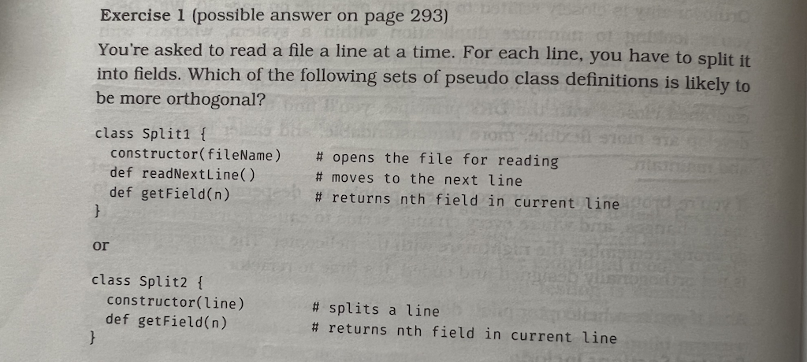

   #### Exercise 2
   - What are the differences in orthogonality between object-oriented and functional languages? Are these differences inherent in the languages themselves, or just the way people use them?

   ## Reversibility

   > Nothing is more dangerous than an idea if it's the only one you have.

   - Engineers prefer simple, singular solutions to problems.
   - Management tends to agree with the engineers: singular, easy answers fit nicely on spreadsheets and project plans.
   - If only the real world would cooperate!
   - If you rely heavily on some fact, you can almost guarantee that it will change.
   - There is always more than 1 way to implement anything.
   - More than 1 vendor who can provide a third party product.
   - More than 1 solution to any problem.
   - Unless you accept above, you may be in for an unpleasant surprise.

   > But you said we'd use database XYZ! We are 85% done coding the project, we can't change now!" the programmer protested. "Sorry, but your company decided to standardize on database PDO instead-for all projects. It's out of my hands. We'll just have to recode. All of you will be working weekends until further notice."

   - With every critical decision, the project team commits to a smaller target-a narrower version of reality that has fewer options.
   - By the time many critical decisions have been made, the target becomes so small that if it moves, or the wind changes direction, or a butterfly in Tokyo flaps its wings, you miss. An you may miss by a huge amount.
   - The problem is that critical decision aren't easily reversible.
   - E.g. once you decide to use this vendor's database, or that architectural pattern, or a certain deployment model, you are committed to a course of action that cannot be undone, except at great expense.

   ### So what is reversibility?
   - Author points out that many topics in the book are geared to producing feasible, adaptable software
   - By following the below in this book, we don't have to make as many critical, irreversibe decisions.
      - DRY principle
      - Decoupling
      - use of external configuration
   - Not making irreversible decisions is good as we don't always make the best decisions the first time
   - Requirements, users, hardware change faster than we can get the software developed.
   - Example of making changes that are usually irrevesible:
      - Changing from relational to document database once you find out that the relational is too slow to cater user needs.
      - Starting the project as browser based app but marketing decides it needs to be mobile app.
   - The mistake lies in assuming that any decision is cast in stone-and in not preparing for the contingencies that might arise.
   - Software decisions are not carved in stone but in sand where a big wave can wipe it out anytime.

   > There Are No Final Decisions

   ### Flexible Architecture
   - Below are some "best practice" server-side architectures:
      - Big hunk of iron
      - Federations of big iron
      - Load-balanced clusters of commodity hardware
      - Cloud-based virtual machines running applications
      - Cloud-based virtual machines running services
      - Containerized versions of the above
      - Cloud-supported serverless applications
      - And, inevitably, an apparent move back to big hunks of iron for some tasks

   - It's a miracle that anything ever worked.
   - So how can you plan for this kind of architectural volatality? You can't.

   - But you can make your application easy to change (ETC again):
      - Break code into components even if deployed to single server. This approach is easier than splitting an monolithic application later on.
      - Hide third party API's behind your own abstraction layers
   - No one knows what the future may hold, especially not us !
   - So enable rock-n-roll: to "rock-on" when it can, to roll with the punches when it must.

   ## Tracer Bullets

   > Ready, fire, aim... - Anon

   ### What are they?
   - We talk about hitting targets when we develop software.
   - Though we are not firing anything at the shooting range, it's a useful and very visual metaphor.
   - It's interesting to consider _how_ to hit a target in a complex and shifting world like software development.

   - Whether you hit the target of course depends a lot on the nature of device you aim with.
   - Usually you hit and then see if you have got the target but there is a better way.

   - Author refers to movies, video games and TV shows where when people hit with guns we see a visible path of bullets as bright streaks in the air.
   - These visible streaks in air comes from tracer bullets which are loaded in intervals along with regular ammunition.

   - Why tracer bullets?
      - Real time immediate feedback to soliders to refine their aim
      - Again, a pragmatic approach

   - Same applies to software projects, particularly when you're building something that hasn't been built before.
      - On a side note, sometimes we think we are just putting pieces together in software but note that the way we put them together is unique and hence we end up creating unique systems.
   - We use the term _tracer bullet development_ to visually illustrate the need for immediate feedback under actual conditions with a moving goal.

   - What are the moving goals?
      - Since your users have not seen anything like what you are developing, the requirements may be vague or may change.
      - You maybe using algorithms, techniques, languages, or libraries you aren't familiar with as a result there are many unknowns.
      - Projects take time to complete and hence the environment/platform you are working on may change before you're done.

   - What is the classic response to this?
      - Write out every requirement freeze them
      - Trying to grasp every known unknown and avoiding unknown unknowns as if they are not there.
      - Constraining ourselves to a type of environment
      - One big calculation upfront, then shoot and hope nothing changes.
   - Result?
      - Create a system that dies eventually

   - Pragmatic Programmers, tend to prefer using the software equivalent of tracer bullets.

   ### Code That Glows in the Dark
   - Tracer bullets operate in same environment with same constraints as real bullets.
   - Immediate feedback to the gunner.

   - To get similar effect in code, we look for something that gets us from requirement to some aspect of final system quickly, visibly, and repeatably.

   - How to do this in code?
      - Look for important requirements of the system - the Must Haves to start with
      - Look for the grey areas which has the huge risk of implementation
   - Then, prioritize your development so that these are the first areas you code.

   > Use Tracer Bullets to Find the Target

   - The very first tracer bullet is Hello World
   - Then built the skeleton of the system which is needed

   #### An example
   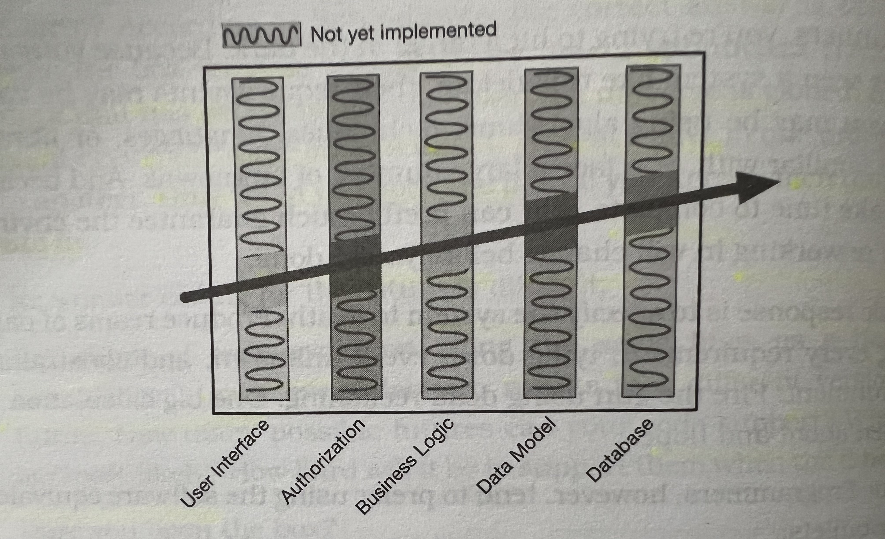

   - Above system has five architectural layers.
   - To understand how we can integrate them, we do a simple feature that uses all the layers.
   - The diagonal line shows the path that feature takes through the code.
   - To make the feature work, we need to just implement the solidly shaded areas in the diagram and the stuff with the squiggles will be done later.

   Below is an example,
   - Assume a complex client-server database marketing project.
   - Part of the requirement was ability to specify and execute [temporal queries](https://blog.devgenius.io/a-query-in-time-introduction-to-sql-server-temporal-tables-145ddb1355d9).
   - DB servers were a range of relational and specialized databases.
   - Client UI written in random language A, used set of libraries written in different language provide interface to the servers.
   - User's query stored on the server in a Lisp-like notation before being converted to optimized SQL prior to execution.
   - Many unknowns, many environments and no one was too sure how the UI should behave.

   - Above is a great opportunity to use tracer code by,
      - Developed a framework for the front end, libraries representing the queries.
      - Structure for converting a stored query into a DB specific query.
   - Then, it above together and checked that it worked.
   - Wrote a query to fetch rows from table with above structure and it worked.
   - This proves that the UI could talk to libraries, libraries could serialize and de-serialize the queries and the corresponding databases can infact retireve the results for the query.
   - Over few months more types of queries where added and the library was enhanced

   - Tracer code is not disposable rather you keep it in the final system
   - It contains all error checking, structuring, documentation and self-checking that any production code has.
   - Only difference is that it is not fully functional.
   - You achieve an end to end connection among the different components or parts of the system and build on top of that.

   - Idea behind Tracer development is:
      - a project is never finished
      - there will always be changes to be done
      - functionality to add
      - incremental approach

   - Convential alternative is:
      - heavy engineering approach
      - code divided into modules which are coded in vacuum
      - modules combined into subassemblies, further combined until one day we have complete application
      - after all this the application can be presented to the user and tested

   - In case of Drupal the tracer code or skeleton is already available as,
      - Frontend using TWIG templates in case of website or having an API in case of headless
      - Backend already working with set of libraries provided by Symphony with MYSQL and interacting with frontend
      - so we directly look into building the actual application on top of the tracer code/skeleton

   - We can still use the concept of tracer code in Drupal by doing the minimal requirement for a feature end to end using the available skeleton rather than looking to complete it 100% and then show a demo.

   #### Advantages of tracer code approach
   - Users get to see something working early
      - if communicated successfully (Topic 52 in book Delight Your Users), your users will know they are seeing something immature and hence would not be disappointed that its not complete.
      - visible progress in an incermental way
      - contribute in decisions right from start and hence we get their buy in
      - the users will also tell us if our tracer code is close to target in each iteration

   - Developers build a structure to work in
      - mostly a challenge if we are starting from scratch : as most daunting piece of paper is the one with nothing written on it
      - gives something to start from and build upon
      - makes the team more productive and encourages consistency

   - You have an integration platform
      - you have the base environment to which you can add peices of code
      - no big-bang integration
      - continous integration immediately post development
      - impact of each change is visible and clear
      - faster debugging and testing

   - You have something to demonstrate
      - Project sponsors want to see demos as most inconvenient time - when it is not ready
      - with tracer code you always have something to show them

   #### Tracer Bullets Don't Always Hit Their Target
   - Tracer bullets helps you to see where you are hitting
      - it does not ensure you hit the target
      - you adjust the aim until they're on target. That's the point.


   - Same with tracer code as well.
   - Use tracer code methodology when you are not sure what you are doing.
      - expect the user to say "that's not what I meant" or data you need isn't available
      - fail fast and learn
      - easy to change as your application is lean with minimal code
      - users are also confident that what they are seeing is a peice of final applicationa and not just a paper specification

   ### Tracer Code versus Prototyping
   - Tracer Code is not an aggressive name for Prototyping (POC)
   - There is a real difference

   - With prototype you aim to explore specific grey areas where you are not sure
      - with a true prototype, you will throw away whatever you did
      - you recode it properly using the lesson learned

   - Example,
      - application that helps shippers determine how to pack odd-sized boxes into containers
      - the UI needs to be interactive like users dragging and dropping boxes into containers and the algorithm to validate if it is optimal packing will be complex

   - In a prototype,
      - you code UI just to show the layout, the elements and get their approval
      - then throw it away and re-do it with proper standards and methods with business logic in place
      - you make your decisions with prototype, you'd start again and code in final environment, interafacing to real world

   - Tacer code addresses a different problem,
      - it helps to see how the application as a whole hangs together
      - shows how interactions work in the final system
      - develops an architectural skeleton on top which the application resides
      - for above example, you create a FCFS container packing algorithm which is very simple and make it to interact with UI when user drags and drops the boxes
      - creates a framework for the developers which stays intact

   - Prototyping generates disposable code whereas Tracer code generates skeleton for final system
   - Think of prototyping as intelligence gathering mechanism that takes place before a single tracer bullet is fired

   ## Prototypes and Post-it Notes
   - Try out specific ideas/concepts
   - Cheaper than full-scale production

   ### Examples
   - Car makers - Prototypes to test specific aspect like aerodynamics, styling, structure, etc...
   - Clay model, wood and duct tape model, virtual reality model

   ### Why Prototypes?
   - Try out risky or uncertain elements without committing to build the real item
   - analyze and expose risk
   - offers chances for correction at a greatly reduced cost much early on
   - test one or more specific aspects of a project which we are unsure of
   - cheaper and faster to develop than applications that go into production
   - we can ignore the things which are unimportant at the moment but important when doing actual project
      - for UI prototype you need not worry about correctness of results
      - for computational or performance prototype you need not worry about UI or even do with no UI
   - if you are in an environment where you cannot give up details like above then a tracer bullet approach is appropriate in that case

   ### Types of Prototypes
   - Prototypes need not be code-based always
   - Post-it notes are good to prototype workflow and application logic
   - UI can be prototyped on a whiteboard or even with paint

   ### Things to Prototype
   Anything that
   - carries risk
   - hasn't been tried before
   - absolutely critical to final system
   - unproven, experimental or doubtful
   - aren't comfortable with

   You can prototype:
   - Architecture
   - New functionality in an existing system
   - Structure or contents of external data
   - Third-party tools or components
   - Performance issues
   - User interface design

   Prototype is a learning experience. Its value lies not in code produced, but in the lessons learned. That's really the point of prototyping.

   > Prototype to Learn

   ### How to Use Prototypes
   When building a prototype, what details can you ignore?

   #### Correctness
   You may be able to use dummy data where appropriate

   #### Completeness
   Prototype may function only in a very limited sense, e.g. with only one preselected piece of input data and one menu item

   #### Robustness
   Error checking is likely to be incomplete or missing entirely. If you give unexpected inputs the prototype may crash and burn and that's okay.

   #### Style
   Prototype code itself may not contain comments although documentation maybe an output or result of prototyping to document the experience and learnings

   ### What to use to Prototype
   - You may want to use high level scripting language such as Python or Ruby for a prototype
   - You may continue in same langauge for actual system or switch to another

   - To prototype UI, use a tool that lets you focus on appearance and/or interactions without worrying about code or markup

   ### Prototyping Architecture
   - Many prototypes are constructed to model the entire system under consideration
   - None of the individual modules in prototype needs to be functional as in tracer bullets
   - You not even need to code to prototype architecture, whiteboard and post-it notes/index card would do

   ### What are the areas you may want to test in architectural prototype?
   - Are the responsibilities of the major areas well defined and appropriate?
   - Are the colloborations between major components well defined?
   - Is coupling minimized?
   - Can you identify potential sources of duplication (DRY areas)?
   - Are interface definitions and constraints acceptable?
   - Does every module have an access path to the data it needs during execution? Does it have the access _when_ it needs it

   The last point generate most surprises and most valuable results from prototyping experience

   ### How Not to Use Prototypes
   - Everyone needs to understand that you are writing disposable code
   - Prototypes can be deceptively attractive to people who don't know that they are just prototypes
   - Make it very clear to all the stakeholders (internal and external) that this code is disposable, incomplete, and unable to be completed

   > Looks can be deceiving, especially good ones.

   - If you don't set the right expectations in beginning, project sponsors or management may insist on deploying the prototype being misled by the apparent completeness of the prototype
   - You can build a great pototype of a car using balsa wood and duct tape but you wouldn't try to drive it in rush hour traffic

   - If you feel there is a strong possibility in your organization culture/environment for prototyping to be misinterpreted, instead go for tracer bullet approach.
   - You end up building a strong foundation for your future development.

   - Properly used prototype can save you huge amounts of time, money and pain
   - Identifies and corrects potential problem spots early in the development cycle - the time when fixing mistakes are cheap and easy

   ### Exercises
   Marketing would like to sit down and brainstorm a few web page designs with you. They are thinking of clickable image maps to take you to other pages and so on. But they can't decide on a model for the image - maybe it's a car, or a phone, or a house. You have a list of target pages and content; they'd like to see a few prototypes. Oh, by the way, you have 15 minutes. What tools might you use?

   ## Domain Languages

   > The limits of language are the limits of one's world.

   - Computer languages influence how you think about a problem, and how you think about communicating
   - Every language comes with a list of features or buzzwords all of which may suggest or obscure certain solutions
   - Designing a solution with C++ in mind will produce different results than a solution based on [Haskell-style](https://en.wikipedia.org/wiki/Haskell) thinking, and vice versa.

   - We try to write code in vocabulary of the application domain - using variables, comments, function names that match close to what we are building
   - Pragmatic programmers can go to the next level and actually program using the vocabulary, syntax and semantics - the language - of the domain.

   > Program Close to the Problem Domain

   ### Some Real-World Domain Languages
   - Let's look at some examples where the program itself is written using the domain language rather than sticking on to a restricted syntax.

   #### RSpec
   - Testing library in Ruby that inspired versions for most other modern languages.
   - Intended to reflect the behavior you expect from your code.

   ```
   describe BowlingScore do
      it "totals 12 if you score 3 four times" do
         score = BowlingScore.new
         4.times { score.add_pins(3) }
         expect(score.total).to eq(12)
      end
   end
   ```
   #### Cucumber
   - Programming language neutral way of specifying tests.
   - You use the version of Cucumber that matches closely to the programming language you use.
   - To support natural language like syntax you also have to write specific matchers that recognize phrases and extract parameters for the tests.

   ```
   Feature: Scoring

   Background:
      Given an empty scorecard

   Scenario: bowling a lot of 3s
      Given I throw a 3
      And I throw a 3
      And I throw a 3
      And I throw a 3
      Then the score should be 12
   ```
   - Cucumber tests are intended to be read by customer to validate what we are developing however that does not happen in real world.

   #### Why ?
   - When you force a business person to read some cucumber tests and sign off it is like telling them to check spelling in language they don't know even if it is like above in a domain specific way
   - Instead given them actual program that does something and that's when you come to know of their actual requirements

   #### Phoenix Routes
   - Web frameworks have routing facility that routes incoming requests to a common file before giving it to final handlers (like index.php)

   - Below is an example from Phoenix

   ```
   scope "/", HelloPhonix do
      pipe_through :browser # Use the default browser stack

      get "/", PageController, :index
      resources "/users", UserController
   end
   ```
   -  This says,
      -  requests starting with "/" will be run through a series of filters appropriate for browsers
      - request to "/" itself will be handled by the _index_ function in the _PageController_ module
      - _UserController_ implements the functions needed to manage a resource accessible via the url _/users_

   #### Ansible
   - Tool that configures software on bunch of remote hosts
   - Reads a spec that you provide and mirros them on the servers
   - Written in YAML

   ```
   - name: install nginx
     apt: name=nginx state=latest

   - name: ensure nginx is running (and enable it at boot)
     service: name=nginx state=started enabled=yes

   - name: write the nginx config file
     template: src=templates/nginx.conf.j2 dest=/etc/nginx/nginx.conf
     notify:
     - restart nginx
   ```

   - This example ensures that latest version of nginx is installed on my servers, that is started by default and then uses the configuration file that you provided

   ### Characteristics of Domain languages
   - Looking at the above examples more closely, we can categorise domain languages into two:
      - RSpec and Phoenix router are written in host languages (i.e.) the langauge of the application itself, here Ruby and Elixir
      - They include some additions like [metaprogramming](https://en.wikipedia.org/wiki/Metaprogramming) and macros but compiled and run as the application code itself.
      - True extensions to your code's vocabulary
      - These are internal domain languages

      - Cucumber and Ansible configurations are writen in own langauges
      - Read by code and converted into some form the code can use to run it
      - These are external languages

   ### Trade-Offs Between Internal and External languages
   - Internal domain language can take advantage of the features of the host langauge
   - You can use a loop in Ruby to iterate and repeat the same code in RSpec and do 100 tests

   ```
   describe BowlingScore do
      (0..4).each do |pins|
         (1..20).each do |throws|
            target = pins * throws
            it "totals #{target} if you score #{pins} #{throws} times" do
               score = BowlingScore.new
               throws.times { score.add_pins(pins) }
               expect(score.total).to eq(target)
            end
         end
      end
   ```

   - Downside of internal domain languages is you're bound by syntax and semantics of the host language.
   - You are forced to compromise between the language you want and language you can implement.
   - Whatever you come up must be a valid syntax in your target langauge

   - External language have no such restrictions as long as you create a parser for the language that can read it and convert it
   - You can use existing parsers' but again it has its limiatations
   - Writing a parser is no trivial task and it needs adding libraries and tools to your application
   - Parser generators can be sort for help like bison or ANTLR

   **Suggestion**
   Don't spend more effort than you save

   - Everything that you do requires additinal effort and that should not be more than what you are hoping to save in long run
   - Use external langauges only in cases when it is written by users of your application who do not know your programming language

   ### An Internal Domain Langauge on the Cheap
   - Use can use a bunch of functions that does the job instead of metaprogamming for internal langauges.
   - RSpec is an example where the keywords _describe, it, expect, to_ and _eq_ are just Ruby methods