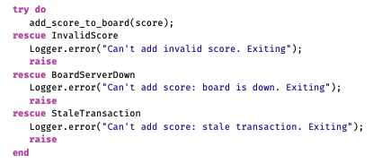

# Pragmatic Paranoia

> You can't write perfect software.

- Accept, Embrace, and celebrate the above fact because perfect software doesn't exist.
- Unless you accept this as a fact, you'll end up wasting time and energy chasing an impossible dream.
- Given this fact, how does a pragmatic programmer turn it into an advantage? This is what we will discus in this chapter.

> _*Everyone knows that they personally are the only good driver on Earth*_

- The rest of the world is out there to get them and generally not living up to our standards. So we drive defensively.
- The analogy with coding is pretty obvious. A lot of times we work on other people's code - code that might not live up to our high standards. Hence, we are taught to code defensively.
- We use assertions to detect bad data & distruct data from potential attackers or trolls.
- We check for consistency, put constraints on database columns, and generally feel pretty good about ourselves.

> _*But Pragmatic programmers take this a step further*_

^^ How??

> Pragmatic Programmers don't trust themselves, either.

> Knowing that fact that no one writes perfect software, including themselves, Pragmatic Programmers build in defenses against their own mistakes.

## Design by Contract

- Dealing with computer system is hard. Dealing with people is even harder.
- One of the best solution for ensuring plain dealing is *contract*

### What is a contract?

A contract defines your rights and responsibilities, as well as those of the other party. In addition, there is an agreement concerning repercurssions if either party fails to abide by the contract.
Example - 
- Employment contract.

Contract is an idea used by the world over - both formally and informally to help humans interact. The same can be used to help software modules interact.

- Bertrand Meyer (Object oriented software construction [Mey97]) developed the concept of *Design by contract* for the language Eiffel.

- Simple yet powerful technique that focuses on documenting the rights and responsibilities of software modules to ensure program correctness.

### What is a correct program?

- One that does no more and no less than it claims to do.
- Documenting and verifying that claim is the heart of Design by contract.

### DBC

- Every function and method in a software does something. It has some expectations and based upon that it delivers some output.

- Meyer describes these expectations and claims as follows - 

### Preconditions

- What must be true in order for the routine to be called: the routines's requirements. A routines should never get called when its preconditions would be violated. It is the caller's responsibility to pass good data.

### Postconditions

- What routine is gauranteed to do; the state of the worls when routine is done. The fact that the routine has a postcondition implies that it will conclude: infinite loops aren't allowed.

### Class invariants

- Class ensures that this condition is always true from the perspective of a caller. During internal processing of a routine, the invariant may not hold, but by the time routine exits and control returns to the caller, the invariant must be true.

* The contract between a routine and any potential caller can thus be read as :

> If all the routines's preconditions are met by the caller, the routine shall gaurantee that all postconditions and invariants will be true when it completes.

If either party fails to live up to the terms of the contract, then a remedy is invoked - maybe an exception is raised, or the program terminates.

> Whatever happens, make no mistake that failure to live up to the contract is a "BUG".

- Some languages have better support for these concepts than others. Clojure, for example, supports pre and post conditions as well as the more comprehensive instrumentation provided by specs. Here's an example of a banking function to make a deposit using simple pre and post conditions:

### Example 1

In this example, there are two *Preconditions* for the `accept-deposit` function:

-- The first is that the amount is greater than zero ( `> amount 0.00` ).

-- The second is that the account is open and valid ( `account-open?` ).

There is also a *Postcondition*: the function gaurantees that the new transaction (`return value of this function, represented here by %`) can be found among the transactions for this account.

Hence, if you call the `accept-deposit` with a positive amount for the deposit and a valid account, it will proceed to create a transaction of the appropriate type and will perform other processing as well.

However, if there is a bug in the program, for example passing negative amount for the deposit , you will get a runtime exception:

- Other languages have features that, while not DBC-specific, can still be used to good effect. For example, Elixir uses `guard clauses` to dispatch function calls against several available bodies:

### Example 2

In this example, calling `accept_deposit` with a large enough amount may trigger additional steps and processing.

Try to call it with an `amount less than or equal to zero`, and you'll get an exception that you can't:

`** (FunctionClauseError) no function clause matching in Deposits.accept_deposit/2`

* This is a better approach than simply checking your inputs: In this case, you simply cannot call this function if your arguments are out of range.

- In *Orthogonality*, we recommend writing *shy* code. here, the emphasis is on *lazy* code: be strict in what you will accept before you begin, and promise as little as possible in return.

> Remember, if your contract indicates that you will accept anything and promise the world in return, then you've got a lot of code to write!

> In any programming language, whether it is functional, object oriented or prodcedural, DBC forces you to *think*.

### Class Invariants and Functional Languages
- Class invariant is a naming thing. Eiffel is an object-oriented language, so Meyer named this idea “class invariant.” But, it’s more general than that. 

_**What this idea really refers to is state**_.

- In an object-oriented language, the state is associated with instances of classes. But other languages have state, too.
- In a functional language, you typically pass state to functions and receive updated state as a result. 
- The concepts of invariants is just as useful in these circumstances.

### DBC and TDD (test driven development)

*QUESTION:* Is design by contract needed in a world where developers practice unit testing, test driven development, property-based testing, or defensive programming.

The short answer is _**yes**_

> DBC and testing are different approaches to the broader topic of program correctness.

They both have value and both have different uses in different situations. DBC offers several advantages over specific testing approaches -

- DBC doesn't require any setup or mocking.
- DBC defines the parameters for success or failure in all cases, whereas testing can only target one specific case at a time.
- TDD and other testing happens only at “test time” within the build cycle. But DBC and assertions are forever: during design, development, deployment, and maintenance.
- TDD does not focus on checking internal invariants within the code under test, it’s more black-box style to check the public interface.
- DBC is more efficient (and DRY-er) than defensive programming, where everyone has to validate data in case no one else does.

_**TDD is a great technique, but as with many techniques, it might invite you to concentrate on the “happy path,” and not the real world full of bad data, bad actors, bad versions, and bad specifications.**_

### Dead program tell no lies

> Have you noticed that sometimes other people can detect that things aren’t well with you before you’re aware of the problem yourself?
- It’s the same with other people’s code
- Sometimes it is a library or framework routine that catches the issue with your software first.

- Example 
-- Maybe we’ve passed in a `nil` value, or an empty list. 
-- Maybe there’s a missing key in that hash, or the value we thought contained a hash really contains a list instead. 
-- Maybe there was a network error or filesystem error that we didn’t catch, and we’ve got empty or corrupted data. 

> It’s easy to fall into the “it can’t happen” mentality
- Most of us have written code that didn’t check that a file closed successfully, or that a trace statement got written as we expected
- We’re coding defensively. We’re making sure that the data is what we think it is, that the code in production is the code we think it is. 
- We’re checking that the correct versions of dependencies were actually loaded.

> All errors give you information
-  You could convince yourself that the error can’t happen, and choose to ignore it
-  Instead, Pragmatic Programmers tell themselves that if there is an error, something very, very bad has happened.

> Don’t forget to Read the Damn Error Message

#### Catch and Release Is for Fish

- Some developers feel that is it good style to catch or rescue all exceptions, re-raising them after writing some kind of message.
- Their code is full of things like this (where a bare raise statement reraises the current exception):

- Here’s how Pragmatic Programmers would write this:
`add_score_to_board(score);`

- We prefer it for two reasons:
1. The application code isn’t eclipsed by the error handling.
2. The code is less coupled.

In the verbose example, we have to list every exception the `add_score_to_board` method could raise. If the writer of that method adds another exception, our
code is subtly out of date. In the more pragmatic second version, the new exception is automatically propagated.

> Tip: Crash Early

### Crash, don't trash

- One of the benefits of detecting problems as soon as you can is that you can crash earlier, and crashing is often the best thing you can do.
- Joe Armstrong, inventor of Erlang and author of Programming Erlang: Software for a Concurrent World [Arm07], is often quoted as saying, `“Defensive programming is a waste of time. Let it crash!"`
- In these environments, programs are designed to fail, but that failure is managed with _supervisors_
- A supervisor is responsible for running code and knows what to do in case the code fails, which could include cleaning up after it, restarting it, and so on.
- **What happens when the supervisor itself fails?** - Its own supervisor manages that event, leading to a design composed of supervisor trees.
- The technique is very effective and helps to account for the use of these languages in high-availability, fault-tolerant systems.
- In other environments, it may be inappropriate simply to exit a running program
- However, the basic principle stays the same—when your code discovers that something that was supposed to be impossible just happened, your program is no longer viable.
- Anything it does from this point forward becomes suspect, so terminate it as soon as possible.

> A dead program normally does a lot less damage than a crippled one.
